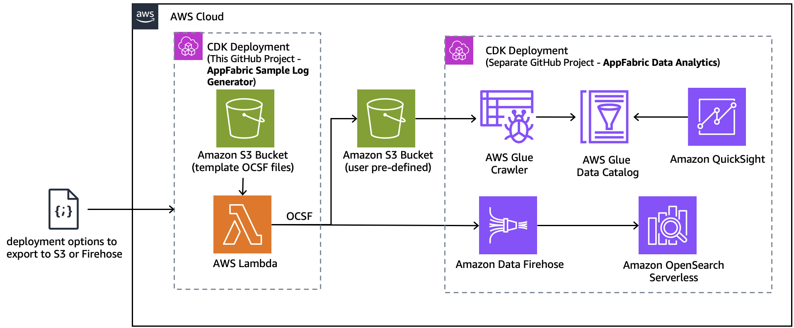

# AppFabric Sample Log Generator

The AppFabric Sample Log Generator produces sample audit log files in the OCSF schema, similar to what [AWS AppFabric](https://aws.amazon.com/appfabric/) would generate as an output from ingesting audit logs from SaaS applications. These sample data in OCSF schema help generate data samples for dashboards on SIEMs like Amazon OpenSearch and Amazon QuickSight. There is a sample SIEM solution called [AppFabric Data Analytics](https://github.com/aws-samples/appfabric-data-analytics), meant to work together with this generator. The timestamps of the sample audit logs are generated within 2 weeks of when the samples are created, making it easy to search for the data on the dashboard.

>**BE AWARE:** This code base is an [Open Source](LICENSE) starter project designed to provide a demonstration and a base to start from for specific use cases. 
It should not be considered fully Production-ready.
If you plan to deploy and use this in a Production environment please review the [Using this in Production](#using-this-in-production) section at the end for some additional guidance.

## Use-case scenario

Simulating [AWS AppFabric](https://docs.aws.amazon.com/appfabric/latest/adminguide/what-is-appfabric.html) OCSF data is difficult to do without an actual enterprise SaaS applications (Okta, Salesforce, Github, etc).  Most applications supported by AWS AppFabric require paid subscriptions.  This solution is used to generate mock data for development or testing other solutions such as: [AppFabric Data Analytics](https://github.com/aws-samples/appfabric-data-analytics)

At a minimum this solution will produce a .tar file of sample log files that can be downloaded, uncompressed, and saved to an Amazon S3 bucket.  The solution optionally accepts a target S3 Bucket and Amazon Firehose stream.  If specified the sample log files will be automatically saved to S3 and injected into the Firehose stream.

>**BE AWARE:** This solution generates sample OCSF formated data based on a set of templates.  It should not be used as a substitution for testing against actual production data.

## Solution components

On a high-level, the solution consists of the following components, each contained in a separate folder:

* cdk-stacks - AWS CDK stacks:
    - `cdk-backend-stack` with all the backend resources needed for the solution (AWS Lambda, Amazon API Gateway, Amazon Cognito etc)

### Solution architecture:  

## Solution prerequisites
* AWS Account
* AWS IAM user with Administrator permissions
* Node (v18) and NPM (v8.19) installed and configured on your computer
* AWS CLI (v2) installed and configured on your computer
* AWS CDK (v2) installed and configured on your computer

## Solution setup

The below instructions show how to deploy the solution using AWS CDK CLI.
These instructions assume you have completed all the prerequisites, and you have an existing Amazon Connect instance, SSO/SAML enabled.

1. Clone the solution to your computer (using `git clone`)

2. Check AWS CLI
    - AWS CDK will use AWS CLI local credentials and region. These can be either
      - environment variables (AWS_ACCESS_KEY_ID AWS_SECRET_ACCESS_KEY, AWS_SESSION_TOKEN, AWS_DEFAULT_REGION) set directly in the command line
      - from a [credentials file](https://docs.aws.amazon.com/cli/latest/userguide/cli-configure-files.html), either using the default profile or setting a specific one (i.e. `export AWS_PROFILE=yourProfile`)
    - check your AWS CLI configuration by running any AWS CLI command (e.g. `aws s3 ls`)
    - you can confirm the configured region with  
            `aws ec2 describe-availability-zones --output text --query 'AvailabilityZones[0].[RegionName]'`
    - AWS SDK (used in the configure script in step 4) can use either the environment variables or credentials file/profile config, however note that the region environment variable in this case is AWS_REGION rather than AWS_DEFAULT_REGION (as used in awscli)

3. Install NPM packages
    - Open your Terminal and navigate to `appfabric-sample-log-generator/cdk-stacks`
    - Run `npm run install:all`
    - This script goes through all packages of the solution and installs necessary modules (webapp, cdk-stacks, lambdas, lambda-layers)

4. Configure CDK stacks
    - In your terminal,  navigate to `appfabric-sample-log-generator/cdk-stacks`
    - Start the configuration script in interactive mode   
      `node configure.js -i`
    - (You can configure it via single command, by directly providing parameters, as described in the script help instructions which you can see by running 
      `node configure.js -h`)
    - When prompted, provide the following parameters:
        - `appfabric-data-source-s3-uri`: (Optional) The S3 uri of the AppFabric data source. For example, enter s3://MyBucket/. If specified, the solution will output sample logs to this location.
        - `kinesis-firehose-arn`: (Optional) If specified the solution will also inject records into the given Kinesis Firehose ARN
        - `scheduler-option`: (Optional) Enter 'yes' to enable. If enabled, solution will create an EventBridge schedule to invoke the log generator every week on Monday at 00:00 UTC. The schedule can be changed after deployment by modifying the cron job of the EventBridge rule.

5. Deploy CDK stacks
    - In your terminal navigate to `appfabric-sample-log-generator/cdk-stacks`
    - If you have started with a new environment, please bootstrap CDK: `cdk bootstrap`
    - Run the script: `npm run cdk:deploy`
    - This script deploys CDK stacks
    - Wait for all resources to be provisioned before continuing to the next step
    - AWS CDK output will be provided in your Terminal.

8. Test the solution
    - Open the Lambda Function generated by the deployment.  The lambda name can be found in the Stack outputs.
    - Run the Lambda Function.  You may need to generate some sample test inputs.  The input doesn't matter and you can send anything.
    - Once the Lambda completes, you should have a .tar file in the Templates directory.  The Lambda function also generates a pre-signed S3 URL that is valid for one day.  The URL is output to the lambda logs.  You can use this URL to download the file, uncompress, and upload to your AppFabric S3 bucket 
    - In addition to the .tar file, the function will also put the sample log files in the S3 Bucket you specified in Step 4.
    - If an Amazon Firehose ARN was specified in Step 4, the solution will also push the log files into the specified Firehose stream.

## Clean up

To remove the solution from your account, please follow these steps:

1. Remove CDK Stacks
    - Run `cdk destroy --all`

2. Remove deployment parameters from AWS System Manager Parameter Store
    - Run `node configure.js -d`

## Using this in Production

It is critical that before you use any of this code in Production that you work with your own internal Security and Governance teams to get the appropriate Code and AppSec reviews for your organization. 

Although the code has been written with best practices in mind, your own company may require different ones, or have additional rules and restrictions.

You take full ownership and responsibility for the code running in your environment, and are free to make whatever changes you need to.

**Some of the things you will want to consider**
- The starter project has extensive logging to CloudWatch, but does not have any monitoring or tracing included, you may want to look at using tools like Cloudwatch Alarms and X-ray.
- The starter project tags all resources with the tags listed in `cdk-stacks/config.params.json` and anything created through the dashboard has the tags in `cdk-stacks/lambdas/constants/Tags.js` added. You may wish to replace them with your own company requirements, or tag at a more granular level.
